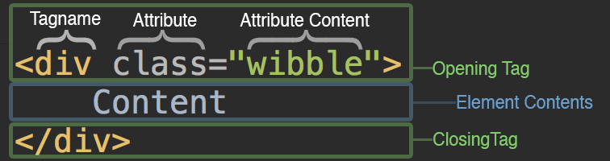

##### Lunch and Learns Series

# What is Frontend development?

## Intro

To understand modern frontend development, it's important to know a bit about its foundations. In day to day work you'll hear references to frameworks like Vue or Angular, but in this series we'll be staying as far away from them as humanly possible. If we get enough interest we can look at running a course on one of those in the future.

For this series; our definition for a website is a handwritten HTML document sitting in a folder on your computer. It wants to include a CSS file to make itself look fancy, and it wants to include a JavaScript file to make itself do cool stuff when the user interacts with it. We'll start by exploring HTML, then CSS, and finally JavaScript.

---------

## Setup

Required software:

* [Visual studio code](https://code.visualstudio.com/)

---------

## The basics

Before we get started I'd like to get you thinking about HTML in the right way:

An imperfect but reguarly called upon analogy for HTML is that it behaves like the wooden frame of a house. It's the structural outline of the website on which everything is built.


Try to keep that in mind throughout the process. Your HTML describes the structure of your building, and you keep all of your stuff in it. In the web  your *stuff* is data (text/media). Once we've learned to build our structure we'll move onto CSS where we can decorate it, before finally adding some automation with JavaScript, like automatic doors and lights.

### Hypertext Markup Language

HTML is the language through which we communicate our website's content to the browser. This language houses tags, attributes and text. A tag is a container of information, an attribute is a tag descriptor, and text is text.



> *What's a **div**?*

> A *Division* is just a container element/tag. It has no semantic qualities, it just holds other tags. It's probably the most common tag used on the web today.

Here are some boring definitions

**Hypertext**

A software system allowing extensive cross-referencing between related sections of text and associated graphic material. (text + pictures)

**Markup**

*"In computer text processing, a markup language is a system for annotating a document in a way that is syntactically distinguishable from the text."*. Which is a complicated way of saying that all of the content in a "markup" language includes some information about what that content is. So for example:

```html
<p>Hello there I am a paragraph. I have multiple sentences. I'm supposed to be read by a human.</p>
```

Here we have a p (paragraph) tag enclosing some content. And because we're using a markup language, the **tags** surrounding the content inform the reader about the **type** of content. In this case we're saying "this is a paragraph - a series of human readable sentences".

### HTML vs HTML5

#### HTML

Our previous house analogy works when you're describing the structural role of HTML, but in my opinion it doesn't do a good job of explaining how HTML describes your *content*. In reality, it's more like a **family tree**, with a single progenitor.

Below is an example of a naïve implementation of a header with a set of links which serve as a website navigation.

*assets/Header_naive.html*

```html
<body>
    <div>
        <a href="/">Home page</a>
        <a href="/about-us">About us</a>
        <a href="/contact-us">Contact us</a>
    </div>
    <div><!-- main content --></div>
    <div><!-- footer content --></div>
</body>
```

> *What's an **a**?*

> An *Anchor* is a functional tag that when clicked will redirect the browser to either another document, or another location on the current document. We commonly refer to these as links. These anchors have an *attribute* called *href* which holds your link destination.

*Tree representation of those elements*


#### HTML5

Here's the same header/navigation implemented in HTML5

*assets/Header_html5.html*

```html
<body>
    <header>
        
        <nav>
            <a href="/">Home page</a>
            <a href="/about-us">About us</a>
            <a href="/contact-us">Contact us</a>
        </nav>
    </header>
    <article><!-- main content --></article>
    <footer><!-- footer content --></footer>
</body>
```

> *Nav?*

> Short for navigation. Tells the device reading the content that it's dealing with some links to content rather than actual content.

*Tree representation of those elements*


HTML5 added a bunch of fun tags for us to work with, and their primary goal is to help us better describe the content of the website. Staying within our family tree analogy, HTML5 improved our ability to label each leaf in the tree. Now as you follow the tree down you can clearly see where families appeared, and also what their job titles were and how they behaved towards one another. Interestingly they actually do nothing for the majority of users. We could build an entire functioning website out of just one tag if we so desired.

There **are** good reasons for writing *semantic markup* or "markup that appropriately describes the content it holds", and they are:

* Accessibility
    * Some people will access your site in unusual ways, for example via a screen-reader tool which enables blind users to *hear* your website, or even read it by touch on a refreshable braille device. If you write it semantically, that screen-reader can follow your document as easily as you might read an email or a word doc. If you don't it will have a really difficult time or not work at all.
* SEO ranking
    * In another universe, the search engine gods care about the quality of your markup and will penalise you for doing a poor job. In our universe they actually don't particularly care, but we pretend that they do because search engine optimisation is a murky area, and doing things as well as possible is just a safe play. It also future proofs us for a potential timeline where Google suddenly decides to kill your ranking if you're inaccessible and lazy.
* Readability
    * Other developers might look at your HTML and if you use tags that help them understand what you're doing then they waste less time figuring it out.

### HTML in the wild

```html
<!-- DON'T CARE -->
<!DOCTYPE html>
<html>
    <head>
        <!-- DON'T CARE -->
        <meta charset="utf-8">
        <meta http-equiv="X-UA-Compatible" content="IE=edge">
        <meta name="viewport" content="width=device-width,initial-scale=1.0">

        <!-- DO CARE A LITTLE BIT -->
        <link rel="icon" href="/favicon.ico">
        <title>Page title</title>
        <meta name="description" content="a description">
        <meta name="keywords" content="keywords, more keywords, more">
    </head>

    <!-- CARE VERY DEEPLY ABOUT THIS BIT -->
    <body>
        <article>
            <h1>Hello world</h1>
        </article>
    </body>
</html>
```

If you open the assets folder in this file's directory you will find a file called Hello_world.html. Double click it to see the above HTML rendered in your default browser. Really, for the short term, you only need to care about the things inside the body tag. Everything in the head tag will be meta data or resource related (JS/CSS/favicon). Meta data is important to a website because it describes what your website does, much the same way HTML tags define what the content does. But we can worry about that when we're actually able to build a website that people would like to visit.

Here's a list of HTML tags that you want to be at least casually familiar with:

| Tagname                | What it's for                                                                                                                                                                    |
|------------------------|----------------------------------------------------------------------------------------------------------------------------------------------------------------------------------|
| Body                   | This tag contains everything that the browser will render. All of your html goes in here.                                                                                        |
| H1, H2, H3, H4, H5, H6 | Headings. 1 for most important, 6 for least.                                                                                                                                     |
| p                      | Paragraph content                                                                                                                                                                |
| div                    | Non-semantic container for other tags                                                                                                                                            |
| span                   | Non-semantic container for phrasing content (text)                                                                                                                               |
| header                 | Header content for the page or article                                                                                                                                           |
| nav                    | Navigation items                                                                                                                                                                 |
| ul                     | Unordered list of things (e.g. bullet list)                                                                                                                                      |
| ol                     | Ordered list of things (e.g. numbered list)                                                                                                                                      |
| li                     | A list item (only allowed inside a UL or an OL tag.                                                                                                                              |
| main                   | The main content of the page                                                                                                                                                     |
| article                | Self-contained composition in a document, page, application, or site, which is intended to be independently distributable or reusable. E.g. a blogpost.                          |
| section                | Section is a blob of content that you could store as an individual record in a database. Rule of thumb is if you're about to add a new title, you might be adding a new section. |


Now that you have a basic knowledge of HTML elements and semantics, open up the experiments/index.html file in your editor of choice and add some stuff inside the Article tag.

See if you can add:

* A title for your page using an h1 tag
* 1 or 2 paragraphs
* A bullet point list (see assets/bullet_points.html for an example of a UL + LI structure)
* A document title (look in the head tag)